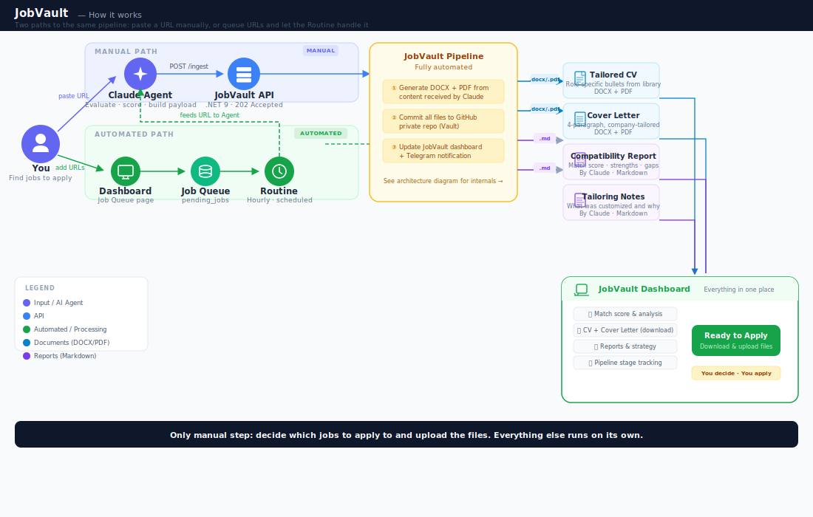
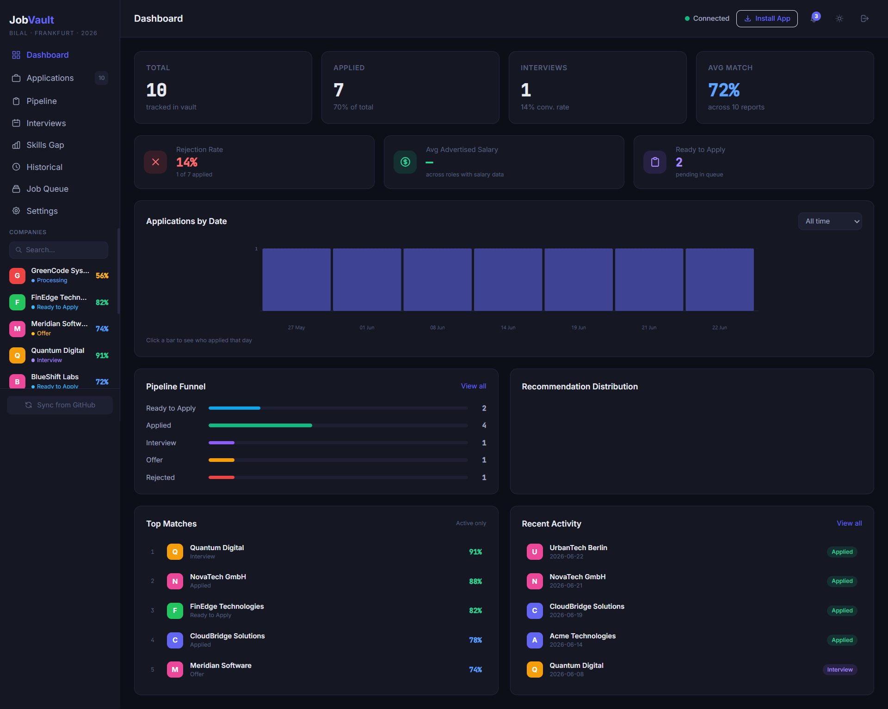
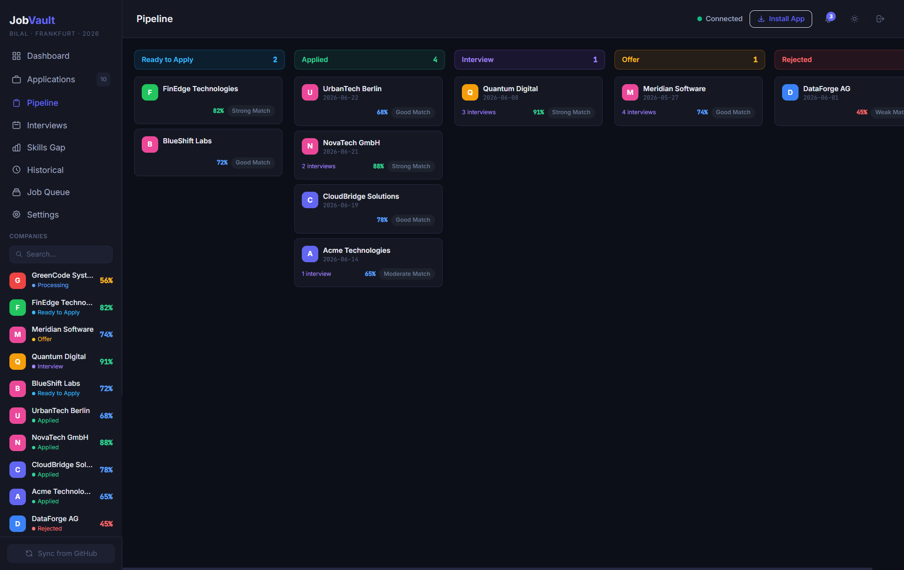
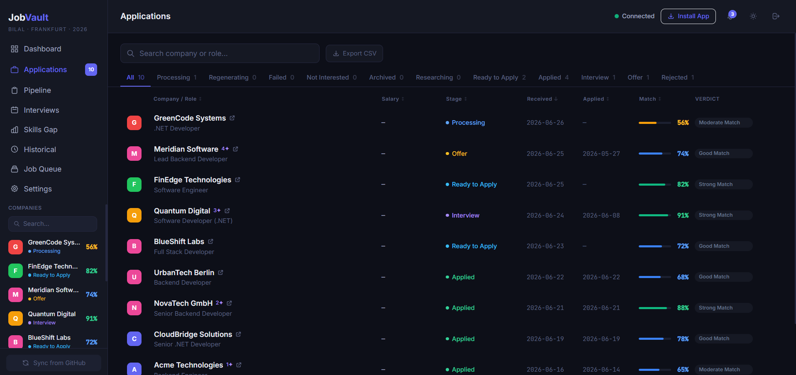
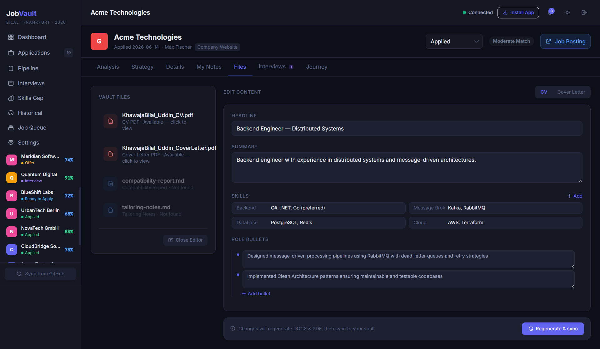
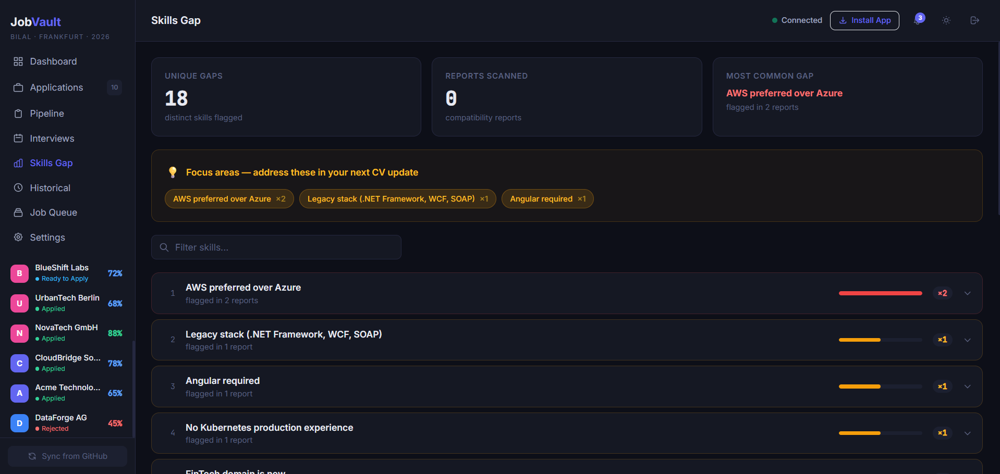
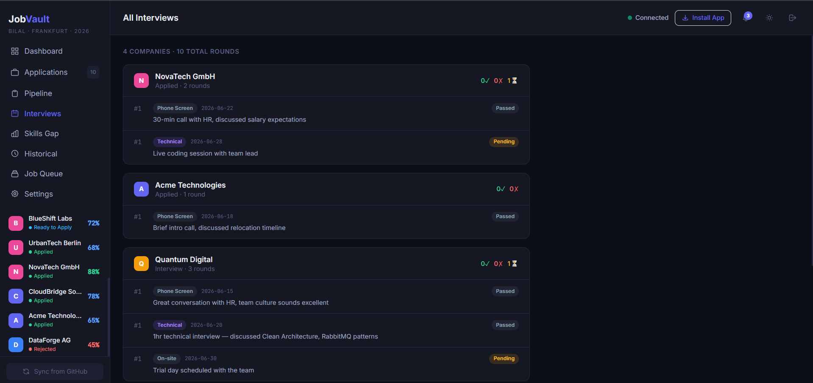
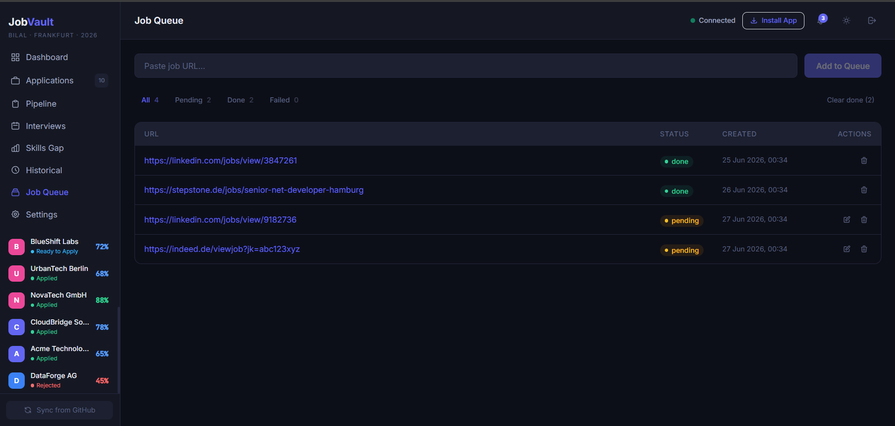
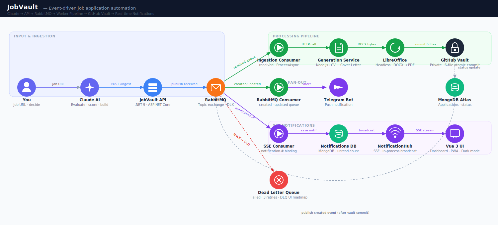

# JobVault


**Live:** [Frontend](https://prd.kbilaluddin.dev) · [API](https://api.kbilaluddin.dev)

---

## The Problem

We all use AI to generate tailored CVs and cover letters now, but the workflow around it is still manual and messy.

**Generating the documents** is the first friction point. You either copy-paste AI output into your CV template by hand, or ask the AI to generate the entire file, which burns tokens and rarely gets the formatting right. Either way, you're spending time on something a machine should handle.

**Tracking what you sent** is the second. After 20+ applications, you can't remember which version of your CV went to which company. Most of us end up maintaining a spreadsheet, manually updating it after every application, hoping we remember to do it.

**Accuracy** is the third. AI will happily invent experience you don't have. If you let it write freely, you end up reviewing every bullet point to make sure it's real, which defeats the purpose of automating in the first place.

I hit all three problems and built JobVault to close the gap.

---

## How It Works

The idea is simple: **AI generates the content, machines handle everything else.**

*Scrolling LinkedIn on the train? Copy the URL, paste it into the queue. By the time you're home, your tailored CV, cover letter, and analysis are ready.*



*AI generates the first draft. You review, edit any content, and regenerate in seconds. Nothing ships without your approval.*

### Two Paths to the Same Pipeline

**Manual:** Paste a job URL directly into the Claude Agent. It evaluates the JD, picks the right bullet points from your library, writes a tailored cover letter, and sends everything as structured data to the JobVault API.

**Automated:** Add job URLs to the queue from the dashboard — on the train, between meetings, wherever. A scheduled Claude Routine picks them up hourly, feeds each one to the same Agent, and the pipeline runs without you touching it.

### What You Get

Every application produces four files:

| File | Format | What It Contains |
|---|---|---|
| **Tailored CV** | DOCX + PDF | Role-specific bullets selected from your library — nothing fabricated |
| **Cover Letter** | DOCX + PDF | 4-paragraph, company-tailored letter |
| **Compatibility Report** | Markdown | Match score, strengths, gaps — Claude's analysis of the fit |
| **Tailoring Notes** | Markdown | What was customized and why — your strategy document |

All four are committed to a private GitHub repository (your vault), the dashboard updates in real time, and Telegram notifies you. When you're ready, open the dashboard, review the files, and apply.

### The Bullet-Point Library

Claude doesn't write bullet points from scratch. It selects from a curated `.md` library of real accomplishments grouped by technology and domain. The prompt constrains it to pick, not invent, so every line on the CV maps to actual experience.

### Claude Agent (Private Repo)

The Claude Agent lives in a [separate private repository](https://github.com/k-bilaluddin/jobvault-claude-agent). It contains the prompt logic, evaluation criteria, bullet-point library, and skills rules — all tightly coupled to my profile. Keeping it separate isolates personal data from the public infrastructure code.

### Screenshots


*Dashboard — stats, pipeline funnel, top matches, recent activity*


*Pipeline — Kanban board across all application stages*


*Applications — searchable list with match scores and verdicts*


*Company Detail — edit CV/cover letter content and regenerate in seconds*


*Skills Gap — identifies missing skills across all job postings*


*Interviews — all rounds grouped by company with outcomes*


*Job Queue — paste URLs, the Routine picks them up automatically*

---

## Architecture



### Performance

The API handles 20 concurrent users at **11ms average response time** with **0% error rate** under sustained load (k6 load test, 2,069 requests over 2 minutes).

### Services

| Service | Technology | Responsibility |
|---|---|---|
| **API** | .NET 9 / ASP.NET Core | Ingestion endpoint, persistence, event publishing, SSE notifications |
| **Worker** | .NET 9 Worker Service | Consumes RabbitMQ events, orchestrates processing pipeline |
| **Document Generation** | Node.js / TypeScript | Generates `.docx` CV and cover letter from structured payload |
| **Claude Agent** | Claude Code / Routine | Evaluates JDs, selects bullets, builds payload (private repo) |
| **Frontend** | Vue 3 / TypeScript / Pinia | Dashboard, pipeline board, job queue, interviews, skills gap, real-time SSE |
| **MongoDB** | Atlas | Stores application records and job queue |
| **RabbitMQ** | CloudAMQP | Async event bus with topic exchange and dead-letter queue |
| **GitHub** | REST API | Stores final application files (DOCX + PDF + reports) |
| **Telegram** | Bot API | Push notifications on application events |

---

## End-to-End Flow

1. **Claude Agent** evaluates a job posting and POSTs a structured JSON payload to `POST /api/ingest/applications`
2. **API** validates the payload, persists the application to MongoDB with status `Processing`, and publishes a `job.application.received` event to RabbitMQ — returns `202 Accepted` immediately
3. **IngestionConsumer** (Worker) consumes the event, fetches the application, and calls the Document Generation Service for CV and cover letter
4. **Document Generation Service** renders Word documents from the payload (role bullets, skills, cover letter paragraphs)
5. **Worker** converts both DOCX files to PDF via LibreOffice
6. **Worker** commits all six files to the GitHub vault repository: `{CV}.docx`, `{CV}.pdf`, `{CoverLetter}.docx`, `{CoverLetter}.pdf`, `compatibility-report.md`, `tailoring-notes.md`
7. **MongoDB** status is updated to `Ready to Apply` with the commit URL
8. **Worker** publishes `job.application.created` and `notification.new` events back to RabbitMQ (feedback loop)
9. **NotificationConsumer** (Worker) sends a Telegram push notification
10. **SseNotificationConsumer** (API) persists the notification and broadcasts via SSE to the dashboard in real time

**Failure handling:** transient failures (generation service down, GitHub network error) retry 3× with exponential backoff. After exhausting retries the message is dead-lettered and the application is marked `Failed`. Permanent failures (invalid payload, 4xx from generation service) skip retries and dead-letter immediately.

---

## Design Decisions

**Why a modular monolith, not microservices**
The API and Worker run as separate processes but share the same codebase. Clean Architecture with architecture tests enforces the same layer boundaries that microservices would, without the network overhead, deployment complexity, or operational burden. At this scale, microservices would add complexity without value.

**Why event-driven in a monolith**
RabbitMQ decouples the ingestion path from the processing path. The API returns `202 Accepted` in 11ms while the Worker handles the heavy lifting (DOCX generation, PDF conversion, GitHub commits) asynchronously. This keeps the API fast regardless of how long processing takes.

**Why the Claude Agent is a separate repo**
The agent contains prompt logic, evaluation criteria, and a curated bullet-point library — all personal data. Keeping it in a private repo separates credentials and personal content from the public infrastructure code.

**Currently a single-user system, designed to generalize**
The architecture is modular (Clean Architecture with enforced layer isolation), but the current deployment serves one user with a single shared dataset. The bullet-point library, prompt logic, and Claude Agent are tightly coupled to my profile — decoupling these into a configurable, multi-user system is the next step.

---

## Features

### Backend
- Async ingestion pipeline with immediate `202` response
- Event-driven processing via RabbitMQ topic exchange
- Dead-letter queue with retry/fast-fail distinction (4xx vs 5xx)
- W3C distributed trace propagation across services
- LibreOffice DOCX → PDF conversion in the Worker container
- GitHub vault commit via Git Trees API (6-file atomic commit)
- Telegram notifications with application details
- Job queue with scheduled Claude Routine for automated processing

### Frontend
- **Dashboard** — stats cards, applications-over-time chart, pipeline funnel, score distribution
- **Pipeline board** — Kanban across Processing → Ready to Apply → Applied → Interview → Offer → Rejected
- **Applications list** — searchable and filterable by stage
- **Job Queue** — add URLs, track pending/processing/completed jobs
- **Company detail** — match score, role bullets, interview history, files
- **Interviews view** — all interviews across applications grouped by company
- **Skills gap** — identifies missing skills across job postings with severity indicators
- **Real-time SSE notifications** — bell icon, unread count, auto-reconnect with backoff
- **PWA** — installable, offline-capable with Workbox caching
- **Dark mode** — CSS variable theming via Tailwind

---

## Project Structure

```
jobvault/
├── backend/
│   ├── src/
│   │   ├── JobVault.API/               # Controllers, Program.cs, Swagger, SSE
│   │   ├── JobVault.Application/       # Interfaces, use cases, service contracts
│   │   ├── JobVault.Domain/            # Entities and value objects
│   │   ├── JobVault.Infrastructure/    # MongoDB, RabbitMQ, GitHub, Telegram, Generation client
│   │   ├── JobVault.Contracts/         # Request/response DTOs, events
│   │   └── JobVault.Worker/            # Background consumers, hosted services
│   └── tests/
│       ├── JobVault.UnitTests/         # Service, controller, and domain tests
│       └── JobVault.ArchitectureTests/ # Enforces Clean Architecture layer rules
├── frontend/
│   └── jobvault-ui/                    # Vue 3 / TypeScript / Pinia SPA
├── jobvault-claude-agent/ → [private repo](https://github.com/k-bilaluddin/jobvault-claude-agent)  # Claude Agent + bullet library
├── generation-service/ → [jobvault-generation-service](https://github.com/k-bilaluddin/jobvault-generation-service)  # Node.js DOCX generation
├── docker/
│   ├── api.Dockerfile
│   ├── worker.Dockerfile
│   └── fonts/                          # Calibri fonts for LibreOffice
├── docker-compose.yml
├── .github/
│   └── workflows/
│       └── ci-cd-with-webhook.yml
└── .env.example
```

---

## Engineering Challenges

**Preventing AI hallucinations**
Claude doesn't write bullet points from scratch. It selects from a curated `.md` library of real accomplishments grouped by technology and domain. The prompt constrains it to pick, not invent, so every line on the CV maps to actual experience.

**Atomic 6-file GitHub commits**
Each application produces six files (CV + cover letter in DOCX and PDF, plus two markdown reports). These are committed in a single atomic operation using the Git Trees API, so the vault never contains a partial application.

**DOCX-to-PDF consistency in Linux containers**
LibreOffice renders fonts differently depending on what's installed. The Worker container bundles native Calibri font files so PDFs match the DOCX output exactly, regardless of the host environment.

**Dead-letter queue with retry/fast-fail distinction**
Not all failures deserve retries. Transient errors (network timeout, generation service down) retry 3x with exponential backoff. Permanent failures (invalid payload, 4xx responses) skip retries and dead-letter immediately, so the queue doesn't waste time on requests that will never succeed.

---

## Tech Stack

| Layer | Technology |
|---|---|
| API | .NET 9, ASP.NET Core, Clean Architecture |
| Worker | .NET 9 Worker Service |
| AI Agent | Claude Code, Claude Routines |
| Document Generation | Node.js, TypeScript, `docx` library |
| PDF Conversion | LibreOffice (headless, in Worker container) |
| Frontend | Vue 3, TypeScript, Pinia, Vue Router, Tailwind CSS |
| Real-time | Server-Sent Events (SSE) |
| PWA | vite-plugin-pwa, Workbox |
| Database | MongoDB Atlas |
| Message Broker | RabbitMQ (CloudAMQP) |
| Notifications | Telegram Bot API |
| File Vault | GitHub (Git Trees API) |
| Containers | Docker, Docker Compose |
| Registry | GitHub Container Registry (GHCR) |
| CI/CD | GitHub Actions |
| Hosting | GitHub Actions self-hosted runner, Cloudflare Tunnel |

---

## Local Development

### Prerequisites

- [.NET 9 SDK](https://dotnet.microsoft.com/download)
- [Node.js 20+](https://nodejs.org/)
- [Docker Desktop](https://www.docker.com/products/docker-desktop/)
- [LibreOffice](https://www.libreoffice.org/) (for local Worker PDF conversion)
- MongoDB Atlas account
- CloudAMQP account (or local RabbitMQ)
- Telegram Bot token + chat ID
- GitHub personal access token (`repo` scope) + target repository

### 1. Clone and configure

```bash
git clone https://github.com/k-bilaluddin/jobvault.git
cd jobvault
cp .env.example .env
# fill in your values
```

### 2. Create the Docker network (first time only)

```bash
docker network create jobvault-internal
```

### 3. Run with Docker Compose

```bash
docker compose up -d
```

Starts `jobvault-api` and `jobvault-worker`. The generation service runs separately on `jobvault-internal`.

### 4. Run services locally

```bash
# API
cd backend/src/JobVault.API && dotnet run

# Worker
cd backend/src/JobVault.Worker && dotnet run

# Generation service (clone from https://github.com/k-bilaluddin/jobvault-generation-service)
cd jobvault-generation-service && npm install && npm start

# Frontend
cd frontend/jobvault-ui && npm install && npm run dev
```

---

## Environment Variables

All variables use `SCREAMING_SNAKE_CASE`. Copy `.env.example` and fill in your values. See [docs/env.md](docs/env.md) for the full reference with descriptions.

---

## API Reference

**Ingestion**

| Method | Endpoint | Description |
|---|---|---|
| `POST` | `/api/ingest/applications` | Ingest a job application payload (async, returns `202`) |
| `POST` | `/api/ingest` | Ingest raw payload |

**Applications**

| Method | Endpoint | Description |
|---|---|---|
| `GET` | `/api/applications` | List all applications |
| `GET` | `/api/applications/{name}/report` | Get compatibility report |
| `GET` | `/api/applications/{name}/notes` | Get application notes |
| `GET` | `/api/applications/{name}/pdf/{type}` | Download CV or cover letter PDF |
| `GET` | `/api/applications/{name}/content` | Get editable CV/cover letter content |
| `GET` | `/api/applications/skills-gap` | Get skills gap analysis across all applications |
| `GET` | `/api/applications/historical` | Get historical (past) applications |
| `POST` | `/api/applications/{name}/stage` | Update pipeline stage |
| `POST` | `/api/applications/{name}/personal-notes` | Update personal notes |
| `POST` | `/api/applications/{name}/interviews` | Add interview record |
| `PUT` | `/api/applications/{name}/interviews/{idx}` | Update interview record |
| `DELETE` | `/api/applications/{name}/interviews` | Delete all interviews |
| `POST` | `/api/applications/{name}/notes` | Add a note |
| `PUT` | `/api/applications/{name}/notes/{noteId}` | Update a note |
| `DELETE` | `/api/applications/{name}/notes/{noteId}` | Delete a note |
| `PATCH` | `/api/applications/{name}/content` | Edit CV/cover letter content |
| `POST` | `/api/applications/{name}/regenerate` | Regenerate DOCX/PDF and sync to vault |
| `POST` | `/api/applications/sync-vault` | Sync all files from GitHub vault |

**Job Queue**

| Method | Endpoint | Description |
|---|---|---|
| `GET` | `/api/ingest/queue` | List all queued jobs |
| `GET` | `/api/ingest/queue/pending` | Get pending jobs (for Routine) |
| `POST` | `/api/ingest/queue` | Add URL to queue |
| `PUT` | `/api/ingest/queue/{id}` | Update job status |
| `DELETE` | `/api/ingest/queue/{id}` | Delete a queued job |
| `DELETE` | `/api/ingest/queue/cleanup/{status}` | Bulk delete by status |

**Notifications**

| Method | Endpoint | Description |
|---|---|---|
| `GET` | `/api/notifications` | Get recent notifications (last 50) |
| `GET` | `/api/notifications/stream` | SSE stream for real-time events |
| `POST` | `/api/notifications/read-all` | Mark all notifications as read |
| `POST` | `/api/notifications/{id}/read` | Mark a single notification as read |

**Auth & Settings**

| Method | Endpoint | Description |
|---|---|---|
| `POST` | `/api/auth/login` | Authenticate and receive JWT token |
| `GET` | `/api/settings` | Get application settings |
| `PUT` | `/api/settings` | Update application settings |

---

## CI/CD

```
Push to master
      ↓
① Architecture tests
      ↓
② Build & push API image  ──┐
                             ├── parallel → GHCR
③ Build & push Worker image ┘
      ↓
④ Self-hosted runner: docker compose pull && up -d
      ↓
⑤ Telegram deployment notification
```

---

## Testing

```bash
# Backend tests (unit + architecture)
cd backend/src/JobVault.API && dotnet test JobVault.sln

# Frontend tests
cd frontend/jobvault-ui && npm test
```

---

## Roadmap

- [x] Async ingestion pipeline (API → RabbitMQ → Worker)
- [x] Document generation service (DOCX via Node.js)
- [x] LibreOffice PDF conversion in Worker container
- [x] GitHub vault commit (6-file atomic commit per application)
- [x] Dead-letter queue with retry/fast-fail distinction
- [x] W3C distributed trace propagation
- [x] Real-time SSE notifications
- [x] Vue 3 frontend with dashboard, pipeline, interviews, skills gap
- [x] PWA support
- [x] Telegram notifications
- [x] GitHub Actions CI/CD + self-hosted deployment
- [x] Job queue with scheduled Claude Routine
- [x] Claude Agent for automated JD evaluation and payload generation
- [x] DLQ management UI (list failed messages, retry button)
- [x] Interview scheduling and tracking improvements
- [x] Expanded dashboard analytics and history views
- [ ] Health checks and observability
- [ ] Multi-user support and configurable bullet-point libraries

---

## Author

**Khawaja Bilal Uddin** — Senior Full Stack Developer, Frankfurt am Main
[kbilaluddin.dev](https://kbilaluddin.dev) · [GitHub](https://github.com/k-bilaluddin) · [LinkedIn](https://www.linkedin.com/in/kbilaluddin/)
