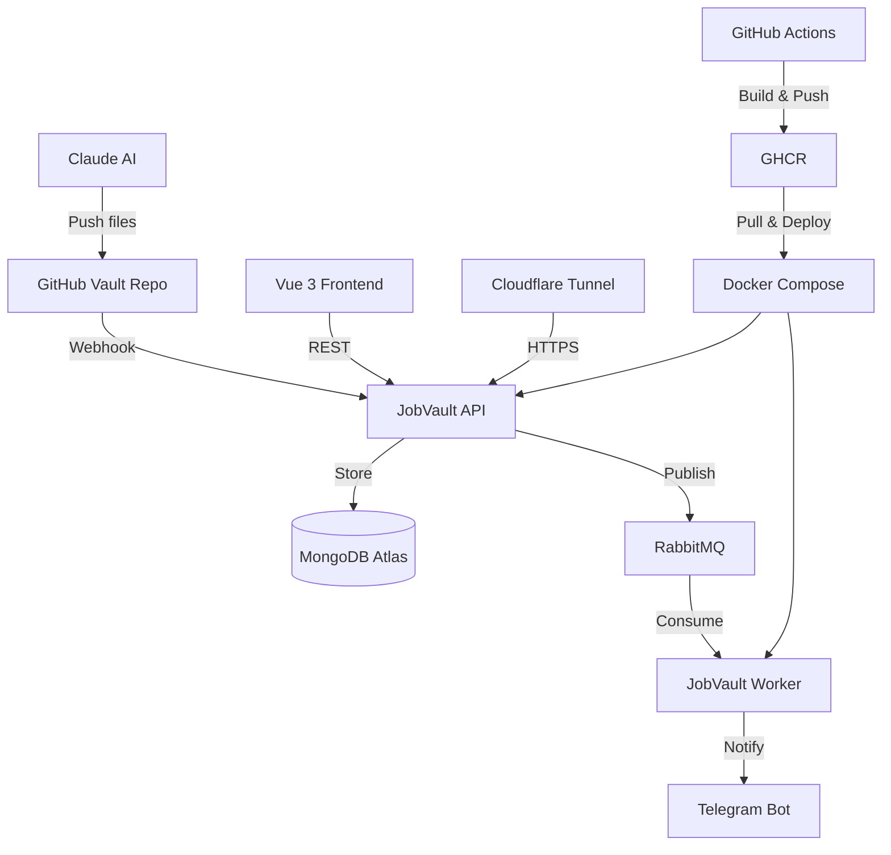

# JobVault


> An AI-powered, event-driven job application pipeline — automating CV tailoring, cover letter generation, and application tracking.

**Live:** [API](https://api.kbilaluddin.dev/swagger/index.html) · [Frontend](https://jobvault.kbilaluddin.dev)

> **⚠️ Project Status: Prototype**
> JobVault is an actively evolving prototype. I'm continuously upgrading it and shipping new features — both to make my own job application workflow easier and as a deliberate vehicle to upskill on production-grade tooling (RabbitMQ, Vue.js, Docker, CI/CD, cloud infrastructure).

---

## What It Does

JobVault automates the entire job application workflow:

1. **Paste a job URL into Claude** — AI extracts the job description and generates tailored CV and cover letter files
2. **Claude pushes files to GitHub** — application documents land in a dedicated vault repo
3. **Webhook triggers** — JobVault API receives the push event and ingests data into MongoDB
4. **RabbitMQ fires events** — application events are published to queues for async processing
5. **Telegram notification** — JobVaultBot sends an instant mobile alert with application details
6. **Track everything in the UI** — review, manage, and follow up on every application from one dashboard

---

## Frontend (Vue 3)

The web UI is the command centre for all applications:

- **Overview dashboard** — see all applications at a glance: status, company, role, and key dates
- **Direct apply** — jump straight from an application card to the original job posting and apply from there
- **Application history** — full timeline of every application, including generated documents and status changes
- **Follow-up notifications** — get reminded when it's time to follow up on an application, so nothing falls through the cracks

---

## Why I Built This

I'm a Senior Full Stack Developer job hunting in Germany. Managing dozens of tailored applications across multiple platforms was becoming a full-time job in itself. Instead of using a spreadsheet, I built JobVault — a system that automates the boring parts while giving me a live portfolio piece that demonstrates real production skills: Clean Architecture, event-driven design, Docker, CI/CD, and cloud infrastructure.

The secondary goal was deliberate upskilling: RabbitMQ depth, Vue.js, Docker, and Cloudflare Tunnel — all things I wanted production experience with, not just tutorials.

---

## Architecture



---

## Tech Stack

| Layer | Technology |
|---|---|
| API | .NET 9 / ASP.NET Core / Swagger |
| Architecture | Clean Architecture (Domain, Application, Infrastructure, Contracts) |
| Database | MongoDB Atlas |
| Message Broker | RabbitMQ (CloudAMQP) |
| Background Services | .NET Worker Service |
| Frontend | Vue 3 + Vite + Pinia |
| Containerisation | Docker + Docker Compose |
| Registry | GitHub Container Registry (GHCR) |
| CI/CD | GitHub Actions |
| Hosting | Windows + Cloudflare Tunnel → Hetzner CX22 *(planned)* |
| Notifications | Telegram Bot API |
| Deploy Trigger | Self-hosted GitHub Actions runner on Windows |

---

## Project Structure

```
jobvault/
├── backend/
│   ├── src/
│   │   ├── JobVault.API/               # ASP.NET Core controllers, Swagger, Program.cs
│   │   ├── JobVault.Application/       # Use cases, service interfaces
│   │   ├── JobVault.Domain/            # Entities, value objects
│   │   ├── JobVault.Infrastructure/    # MongoDB, RabbitMQ, Telegram, GitHub
│   │   ├── JobVault.Contracts/         # DTOs, request/response models
│   │   └── JobVault.Worker/            # Background hosted services
│   └── tests/
│       └── JobVault.ArchitectureTests/ # Architecture enforcement tests
├── frontend/                           # Vue 3 + Vite + Pinia
├── docker/                             # Dockerfiles for API and worker images
├── docker-compose.yml
├── .github/
│   └── workflows/
│       └── ci-cd-with-webhook.yml
└── .env.example
```

---

## CI/CD Pipeline

```
Push to master
      ↓
GitHub Actions
      ↓
① Run Architecture Tests (35s)
      ↓
② Build & Push API Image  ──┐
                             ├── parallel → GHCR
③ Build & Push Worker Image ┘
      ↓
④ Self-hosted Windows runner deploy job
      ↓
⑤ docker compose pull && docker compose up -d
      ↓
⑥ Telegram: "🚀 JobVault deployed"
```

---

## Local Development

### Prerequisites

- [.NET 9 SDK](https://dotnet.microsoft.com/download)
- [Docker Desktop](https://www.docker.com/products/docker-desktop/)
- [Node.js 20+](https://nodejs.org/)
- MongoDB Atlas account
- CloudAMQP account (free tier works)
- Telegram Bot token

### 1. Clone the repo

```bash
git clone https://github.com/k-bilaluddin/jobvault.git
cd jobvault
```

### 2. Configure environment variables

```bash
cp .env.example .env
# Fill in your values
```

### 3. Run with Docker Compose

```bash
docker compose up -d
```

This starts:
- `jobvault-api` → http://localhost:5000/swagger
- `jobvault-worker` → background service

### 4. Run API locally (without Docker)

```bash
cd backend/src/JobVault.API
dotnet restore
dotnet run
```

### 5. Run frontend locally

```bash
cd frontend
npm install
npm run dev
```

---

## Environment Variables

| Variable | Description | Example |
|---|---|---|
| `MONGODB_CONNECTION_STRING` | MongoDB Atlas connection URI | `mongodb+srv://...` |
| `MONGODB_DATABASE_NAME` | Database name | `jobvault` |
| `RABBITMQ_CONNECTION_STRING` | CloudAMQP AMQP URI | `amqps://...` |
| `TELEGRAM_BOT_TOKEN` | Telegram bot token | `123456:ABC...` |
| `TELEGRAM_CHAT_ID` | Your Telegram chat ID | `987654321` |
| `GITHUB_TOKEN` | PAT for vault repo access | `ghp_...` |
| `GITHUB_REPO_OWNER` | GitHub username | `k-bilaluddin` |
| `GITHUB_REPO_NAME` | Vault repo name | `job-applications-vault` |

---

## Docker Images

Images are published to GitHub Container Registry on every push to `master`:

```bash
docker pull ghcr.io/k-bilaluddin/jobvault-api:latest
docker pull ghcr.io/k-bilaluddin/jobvault-worker:latest
```

---

## Roadmap

- [x] Clean Architecture backend
- [x] MongoDB integration
- [x] RabbitMQ event pipeline
- [x] Telegram notifications
- [x] GitHub webhook ingestion
- [x] Docker + Docker Compose
- [x] GitHub Actions CI/CD
- [x] Self-hosted GitHub Actions deployment on Windows
- [x] Cloudflare Tunnel (HTTPS, no open ports)
- [x] Vue 3 frontend — overview dashboard, direct apply, history, follow-up notifications *(prototype)*
- [ ] Migrate to Hetzner CX22
- [ ] Health endpoint + monitoring
- [ ] More features to ease the application workflow — continuously evolving

---

## Author

**Khawaja Bilal Uddin** — Senior Full Stack Developer
Frankfurt am Main, Germany
[kbilaluddin.dev](https://kbilaluddin.dev) · [GitHub](https://github.com/k-bilaluddin)
