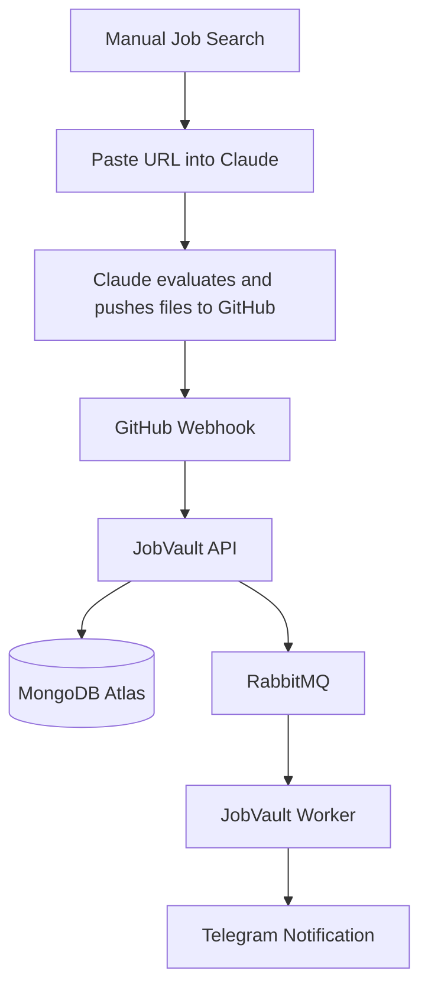
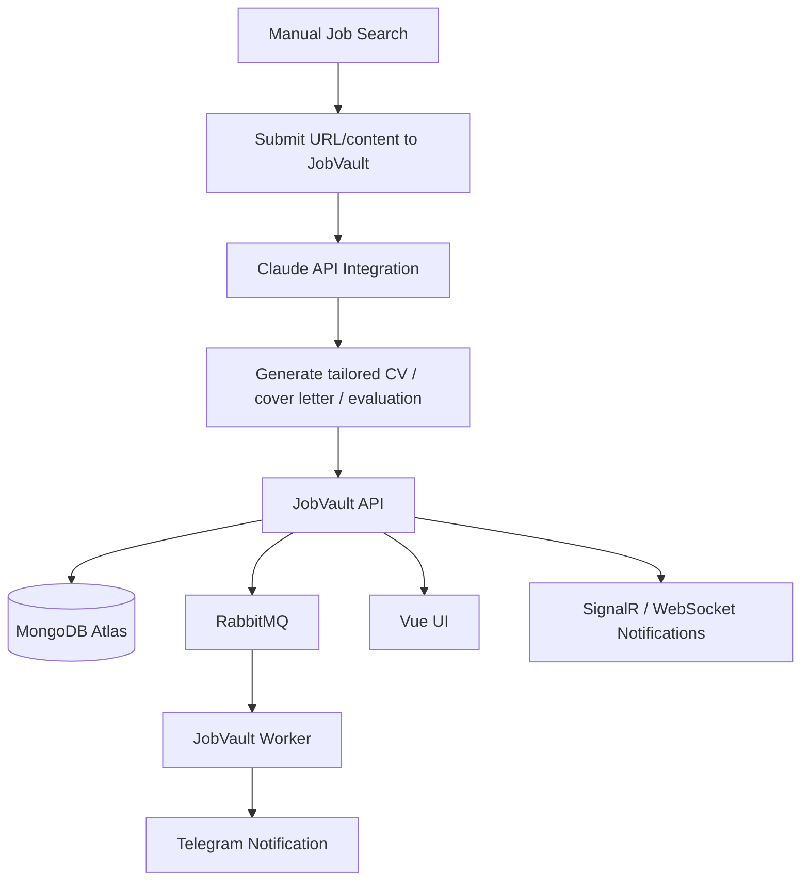

# JobVault


> A modern job application management platform focused on ingestion, event-driven processing, notifications, and the future automation of AI-assisted application workflows.

**Live:** [API](https://api.kbilaluddin.dev/swagger/index.html) · [Frontend](https://jobvault.kbilaluddin.dev)

> **⚠️ Project Status: Active Prototype**  
> JobVault is an actively evolving prototype built around my real-world job application workflow. It already implements the backend ingestion and notification pipeline, while the richer UI and deeper AI integration are planned next.

---

## Overview

JobVault is a personal job application management platform designed to reduce repetitive work around evaluating roles, generating tailored application documents, and tracking the progress of applications over time.

Today, JobVault primarily automates the **post-generation pipeline**:

- ingesting application data after GitHub receives generated files
- persisting that data into MongoDB
- publishing asynchronous events via RabbitMQ
- processing background tasks in a worker
- sending real-time Telegram notifications

The long-term vision is broader: integrate Claude API directly into JobVault so that **only job discovery remains manual**, while the rest of the workflow becomes increasingly automated.

---

## Current Scope vs Target Scope

### Current scope in this repository

This repository currently focuses on the **backend ingestion and event-processing pipeline** after application files have been generated and pushed to GitHub.

#### Currently implemented

- GitHub webhook ingestion
- MongoDB persistence
- RabbitMQ event publishing
- .NET worker-based event consumption
- Telegram notifications
- Dockerised deployment
- GitHub Actions CI/CD pipeline
- Clean Architecture backend structure

#### Not yet fully implemented in this repository

- in-app job discovery/search
- direct Claude API integration
- fully connected MongoDB-backed production UI
- live in-app notifications via WebSocket/SignalR
- end-to-end autonomous application flow

### Target scope

A key next step is integrating **Claude API** directly into JobVault.

Once that happens, the intended workflow becomes:

1. manually search for jobs
2. submit a relevant job URL/content into JobVault
3. JobVault sends it to Claude API
4. Claude evaluates the role and generates tailored application assets
5. JobVault persists, tracks, and notifies automatically

That would leave **job discovery as the only manual step**.

---

## End-to-End Workflow

### Current workflow

The current workflow spans both **manual/external steps** and **application-managed steps**.

#### Manual / external steps

These steps are currently outside the runtime scope of this repository:

1. Jobs are discovered manually by skimming job boards or listings
2. Once a role looks relevant, the job URL is pasted into Claude
3. Claude evaluates the posting and, based on configuration, generates tailored assets and pushes them to GitHub

This is part of the broader workflow, but not yet handled inside JobVault itself.

#### JobVault-managed steps

Once GitHub receives a push, JobVault takes over:

1. GitHub triggers a webhook to the JobVault API
2. The API ingests the incoming data and persists it to MongoDB
3. The API publishes an event to RabbitMQ
4. A background worker consumes the event
5. A Telegram notification is sent with the new application details

### Why Telegram notifications exist

Telegram notifications solve a practical batching problem.

Sometimes multiple job URLs are pasted into Claude at once — for example, 10–15 listings in one go. Claude then evaluates those opportunities and pushes only the relevant generated files one by one.

Without notifications, GitHub or the app would need to be checked manually to know which jobs were actually processed.

With Telegram in place, each accepted/relevant application arrives as its own notification, creating a low-friction monitoring layer for the pipeline.

---

## Architecture

### Current architecture



### Target architecture



---

## Features

### Implemented now

- **Webhook-driven ingestion** — receive GitHub push events and start the processing pipeline automatically
- **MongoDB persistence** — store job application data centrally for later querying and tracking
- **Event-driven architecture** — publish processing events to RabbitMQ for asynchronous handling
- **Background worker processing** — consume queue events in a dedicated .NET worker service
- **Telegram alerts** — receive instant notifications whenever new relevant application data arrives
- **Dockerised services** — run the API and worker in containers
- **Automated CI/CD** — build, publish, and deploy via GitHub Actions and GHCR

### Planned next

- **Claude API integration** — bring evaluation and document generation into JobVault
- **Vue.js application UI** — replace/expand prototype UI with a cleaner production-oriented frontend
- **MongoDB-backed UI views** — surface persisted application data directly in the interface
- **Live UI notifications** — use WebSocket/SignalR for real-time updates in the frontend
- **Interview workflow improvements** — expand interview tracking and timeline visibility
- **Application insights and dashboards** — improve overview, reporting, and history visualisation

---

## UI Status

### Current reality

The production-ready UI is **not yet fully implemented in this repository**.

Although the repo contains a frontend folder, the meaningful application-management experience is still in transition and should be considered **planned/in-progress**, not a completed feature.

### Legacy prototype

A previous Flask-based prototype explored the following views:

- Report
- Tailoring Notes
- Details
- My Notes
- Interviews
- Files
- Pipeline
- Overview
- History
- All Interviews
- LinkedIn

That prototype was **file-based**, storing data in JSON rather than MongoDB.

### Planned UI direction

The long-term UI direction is:

- Vue.js-based frontend
- cleaner, more focused information architecture
- MongoDB-backed data access
- relevant application views only
- eventual real-time notifications inside the UI

---

## Tech Stack

| Layer | Technology |
|---|---|
| API | .NET 9 / ASP.NET Core / Swagger |
| Architecture | Clean Architecture (Domain, Application, Infrastructure, Contracts) |
| Database | MongoDB Atlas |
| Message Broker | RabbitMQ (CloudAMQP) |
| Background Processing | .NET Worker Service |
| Frontend Direction | Vue 3 + Vite + Pinia |
| Legacy Prototype | Flask + JSON file storage |
| Containerisation | Docker + Docker Compose |
| Registry | GitHub Container Registry (GHCR) |
| CI/CD | GitHub Actions |
| Hosting | Windows + Cloudflare Tunnel → Hetzner CX22 *(planned)* |
| Notifications | Telegram Bot API |
| Future Real-Time UI | SignalR or WebSocket-based notifications |

---

## Project Structure

```text
jobvault/
├── backend/
│   ├── src/
│   │   ├── JobVault.API/               # ASP.NET Core API, controllers, Program.cs, Swagger
│   │   ├── JobVault.Application/       # Use cases, orchestration, service contracts
│   │   ├── JobVault.Domain/            # Domain entities and value objects
│   │   ├── JobVault.Infrastructure/    # MongoDB, RabbitMQ, Telegram, GitHub integrations
│   │   ├── JobVault.Contracts/         # DTOs and request/response models
│   │   └── JobVault.Worker/            # Background consumer/worker services
│   └── tests/
│       └── JobVault.ArchitectureTests/ # Architecture enforcement tests
├── frontend/                           # Vue-based frontend work (planned/in progress)
├── docker/                             # Dockerfiles and image-related setup
├── docker-compose.yml
├── .github/
│   └── workflows/
│       └── ci-cd-with-webhook.yml
└── .env.example
```

---

## CI/CD Pipeline

```text
Push to master
      ↓
GitHub Actions
      ↓
① Run Architecture Tests
      ↓
② Build & Push API Image  ──┐
                             ├── parallel → GHCR
③ Build & Push Worker Image ┘
      ↓
④ Self-hosted Windows runner deploy job
      ↓
⑤ docker compose pull && docker compose up -d
      ↓
⑥ Telegram: deployment notification
```

---

## Local Development

### Prerequisites

- [.NET 9 SDK](https://dotnet.microsoft.com/download)
- [Node.js 20+](https://nodejs.org/)
- [Docker Desktop](https://www.docker.com/products/docker-desktop/)
- MongoDB Atlas account
- CloudAMQP account (or another RabbitMQ instance)
- Telegram Bot token

### 1. Clone the repository

```bash
git clone https://github.com/k-bilaluddin/jobvault.git
cd jobvault
```

### 2. Configure environment variables

```bash
cp .env.example .env
# fill in your values
```

### 3. Run with Docker Compose

```bash
docker compose up -d
```

This starts the currently implemented services:

- `jobvault-api` → API / Swagger endpoint
- `jobvault-worker` → background event consumer

### 4. Run the API locally without Docker

```bash
cd backend/src/JobVault.API
dotnet restore
dotnet run
```

### 5. Run the frontend locally

```bash
cd frontend
npm install
npm run dev
```

> Note: the frontend is still evolving and should currently be treated as in-progress rather than a fully complete product surface.

---

## Environment Variables

| Variable | Description | Example |
|---|---|---|
| `MONGODB_CONNECTION_STRING` | MongoDB Atlas connection URI | `mongodb+srv://...` |
| `MONGODB_DATABASE_NAME` | Database name | `jobvault` |
| `RABBITMQ_CONNECTION_STRING` | CloudAMQP / RabbitMQ AMQP URI | `amqps://...` |
| `TELEGRAM_BOT_TOKEN` | Telegram bot token | `123456:ABC...` |
| `TELEGRAM_CHAT_ID` | Destination Telegram chat ID | `987654321` |
| `GITHUB_TOKEN` | Personal access token for GitHub access | `ghp_...` |
| `GITHUB_REPO_OWNER` | GitHub username/owner for the vault repo | `k-bilaluddin` |
| `GITHUB_REPO_NAME` | Target repository storing generated application files | `job-applications-vault` |

If Claude API integration is added later, this section will likely expand with additional AI/provider configuration.

---

## API Documentation

Swagger is available at:

- **Production:** `https://api.kbilaluddin.dev/swagger/index.html`
- **Local:** `http://localhost:5000/swagger`

The API is responsible for:

- receiving webhook events
- ingesting generated application data
- persisting application records
- publishing downstream processing events
- supporting future frontend-driven application views

---

## Docker Images

Images are published to GitHub Container Registry on pushes to `master`.

```bash
docker pull ghcr.io/k-bilaluddin/jobvault-api:latest
docker pull ghcr.io/k-bilaluddin/jobvault-worker:latest
```

---

## Testing

Architecture tests can be run locally with:

```bash
cd backend/tests/JobVault.ArchitectureTests
dotnet test
```

Over time, this can be expanded with:

- unit tests for application logic
- integration tests for webhook ingestion
- infrastructure tests around MongoDB/RabbitMQ integrations
- end-to-end tests for the future frontend and workflow automation

---

## Engineering Focus

JobVault is intentionally more than a utility project. It is also a platform for sharpening practical production-facing skills, including:

- Clean Architecture design
- asynchronous event-driven systems
- infrastructure integration across MongoDB, RabbitMQ, Telegram, and GitHub
- container-based deployment
- CI/CD automation
- self-hosted deployment workflows
- future AI service integration into operational pipelines

---

## Known Limitations

JobVault is still a prototype and currently has several intentional limitations:

- job discovery is still manual
- Claude processing is not yet integrated directly into the application via API
- the UI is not yet complete or fully MongoDB-backed
- some workflow steps remain personal-workflow-specific rather than generalised for wider users
- real-time in-app notifications are still planned
- end-to-end autonomous orchestration is still in progress

These limitations are known and are part of the current roadmap rather than accidental omissions.

---

## Roadmap

- [x] Clean Architecture backend
- [x] MongoDB persistence
- [x] RabbitMQ event pipeline
- [x] Telegram notifications
- [x] GitHub webhook ingestion
- [x] Docker + Docker Compose
- [x] GitHub Actions CI/CD
- [x] Self-hosted deployment flow
- [x] Cloudflare Tunnel setup
- [ ] Claude API integration for in-app evaluation and document generation
- [ ] Reduce manual workflow to job discovery only
- [ ] Vue.js UI backed by MongoDB data
- [ ] Live UI notifications via SignalR/WebSockets
- [ ] Expanded interview tracking
- [ ] Improved dashboard, history, and reporting views
- [ ] Migration to Hetzner CX22
- [ ] Health checks and monitoring

---

## Contributing

This is currently a personal workflow and portfolio project, but feedback and ideas are welcome.

If you would like to contribute:

1. open an issue first to discuss the change
2. fork the repository and create a feature branch
3. submit a pull request with a clear explanation of the change

---

## License

This repository does not currently declare a license.

If code reuse is intended in the future, a license file can be added explicitly.

---

## Author

**Khawaja Bilal Uddin**  
Senior Full Stack Developer  
Frankfurt am Main, Germany  
[kbilaluddin.dev](https://kbilaluddin.dev) · [GitHub](https://github.com/k-bilaluddin)
